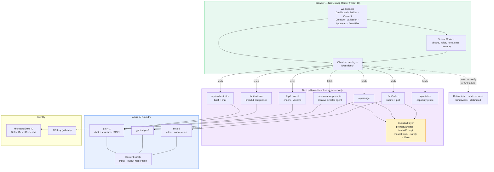

# Campaign Autopilot

> **One prompt to a brand-validated campaign. With guardrails.**

An enterprise-grade reference application showing how an **AI marketing operations workspace** can turn a plain-English campaign idea into a **brand-validated, compliance-checked, channel-ready content package** — including generated imagery and a hero video.

Built with **Next.js 14 (App Router)**, **TypeScript**, **Tailwind**, and **Azure AI Foundry** (`gpt-4.1`, `gpt-image-2`, `sora-2`).

> **All brands, campaigns, compliance rules, people, and metrics in this repository are fictional.**
> Contoso is Microsoft's standard sample company name. Nothing here represents any real organization's
> brand guidelines, legal policy, marketing data, or compliance posture. Every brand rule is flagged
> `demoPlaceholder: true` in code for exactly this reason.

---

## Table of contents

- [What it does](#what-it-does)
- [Architecture](#architecture)
- [Quick start](#quick-start)
- [Configuration](#configuration)
- [Deploy to Azure](#deploy-to-azure)
- [How the multi-tenant model works](#how-the-multi-tenant-model-works)
- [Responsible AI guardrails](#responsible-ai-guardrails)
- [Project structure](#project-structure)
- [FAQ & troubleshooting](#faq--troubleshooting)
- [Grounding it on your own content](#grounding-it-on-your-own-content)
- [Taking this further](#taking-this-further)

---

## What it does

The app models the real workflow of a marketing team, with an AI agent at each stage:

| Workspace | Route | What happens |
|---|---|---|
| **Dashboard** | `/` | KPIs, recent campaigns, live brand/compliance pulse |
| **Campaign Builder** | `/builder` | Conversational brief-building — the agent drafts objective, audiences, messages, KPIs, risks, and required disclaimers alongside you |
| **Content Studio** | `/content` | Generates channel-specific variants (email, paid social, landing page, display, SMS) from the approved brief |
| **Creative Studio** | `/creative` | Requests visual concept sets through an MCP-style tool gateway; generates images with `gpt-image-2` |
| **Validation Center** | `/validation` | Scores the package against brand rules and returns findings with severity, evidence, and remediation |
| **Approval Center** | `/approvals` | Reviewer queue with decisions, comments, and an audit history |
| **Auto-Pilot** | `/auto` | Runs the entire pipeline end-to-end — brief → validation → content → creative prompts → images → hero video with native audio |

**Auto-Pilot is the flagship demo.** One prompt produces a full campaign package in a single orchestrated run, including a 12-second Sora-2 video with voiceover, music, and SFX.

---

## Architecture



### Key design decisions

**Agents write prompts for other agents.** The creative-director agent (`/api/creative-prompts`) reads the campaign brief and emits production-ready prompts for two *different* models — three still-image prompts for `gpt-image-2` plus one motion prompt and a structured audio block for `sora-2`. That handoff is the interesting part of the pipeline.

**Every model call is server-side.** API route handlers are the only thing that touches Azure. Credentials never reach the browser. The client service layer talks to same-origin routes.

**Graceful degradation is built in.** `/api/status` reports which capabilities are actually wired up. If Azure isn't configured — or a call fails — the UI falls back to deterministic seed content and shows a connection banner. The demo never hard-crashes in front of an audience.

**Brand config is data, not code.** Adding a brand means adding one `Tenant` object. No UI changes.

---

## Quick start

```bash
# 1. Install
npm install

# 2. Configure
cp .env.example .env.local
#    then edit .env.local with your Foundry endpoint + deployment names

# 3. Authenticate (recommended path — no API keys)
az login

# 4. Run
npm run dev
```

Open <http://localhost:3000>.

### Prerequisites

- Node.js 18.17+
- An **Azure AI Foundry** resource with deployments for the models you want:
  - `gpt-4.1` (or any chat model) — required for briefs, content, validation, prompts
  - `gpt-image-2` — optional, for the Creative Studio
  - `sora-2` — optional, for the hero video
- Either `az login` with the **Cognitive Services OpenAI User** role, or an API key

The app runs **without any Azure configuration** — it just serves mock content. That's a legitimate way to explore the UX first.

---

## Configuration

All settings live in `.env.local` (never committed — `.gitignore` excludes `.env*` except the example).

```bash
# Foundry v1 endpoint (required for gpt-image-2 / sora-2)
AZURE_OPENAI_ENDPOINT=https://YOUR-RESOURCE-NAME.openai.azure.com/openai/v1

# Leave blank to use Entra ID via DefaultAzureCredential (recommended)
AZURE_OPENAI_API_KEY=

AZURE_OPENAI_CHAT_DEPLOYMENT=gpt-4.1
AZURE_OPENAI_IMAGE_DEPLOYMENT=gpt-image-2
AZURE_OPENAI_VIDEO_DEPLOYMENT=sora-2

AZURE_OPENAI_API_VERSION=preview
AZURE_OPENAI_IMAGE_API_VERSION=preview
AZURE_OPENAI_VIDEO_API_VERSION=preview

# Kill switches — useful for cost control or a text-only demo
DISABLE_IMAGE_GENERATION=false
DISABLE_VIDEO_GENERATION=false
```

**Two endpoint shapes are auto-detected:**

| Shape | URL | Notes |
|---|---|---|
| Foundry v1 | `https://<resource>.openai.azure.com/openai/v1` | Required for `gpt-image-2` and `sora-2`. Model name goes in the request body. |
| Classic Azure OpenAI | `https://<resource>.openai.azure.com` | Deployment name goes in the URL path. |

**Authentication precedence:** if `AZURE_OPENAI_API_KEY` is set it is used; otherwise `DefaultAzureCredential` acquires an Entra token (picking up `az login`, managed identity, or `AZURE_CLIENT_ID`/`AZURE_CLIENT_SECRET`/`AZURE_TENANT_ID`). Enterprise Foundry tenants commonly disable keys, so Entra ID is the default path.

---

## Deploy to Azure

The `Deploy to Azure` GitHub Actions workflow creates a dedicated `campaign-autopilot-production-rg` resource group, provisions Azure Container Apps, Azure Container Registry, Log Analytics, and a user-assigned managed identity in `eastus2`, then builds and deploys the application container. It connects the app to the existing `campaignautopilotai260814` Azure OpenAI account, validates the required `gpt-4.1`, `gpt-image-2`, and `sora-2` deployments, and grants the runtime identity passwordless model access. Pushes to `main` deploy automatically; the workflow can also be run manually. Later runs update the workload group only when its workload and environment tags match.

Bootstrap a separate user-assigned identity for GitHub OIDC and configure the repository's `production` environment:

```bash
chmod +x scripts/setup-azure-auth-for-pipeline.sh
scripts/setup-azure-auth-for-pipeline.sh \
  c8fad4c4-3897-42b5-bbc2-5d96f255f209 \
  mrhoads/campaign-autopilot \
  eastus2 \
  production
```

The script configures the required Azure IDs and deployment settings. See [`.azure/pipeline-setup.md`](.azure/pipeline-setup.md) for the RBAC model, environment protection rules, and first-deployment steps.

Configure any optional application variables in the same GitHub environment:

| Variable | Required | Value |
|---|---:|---|
| `AZURE_OPENAI_RESOURCE_GROUP_NAME` | No | Defaults to `campaign-autopilot-rg` |
| `AZURE_OPENAI_ACCOUNT_NAME` | No | Defaults to `campaignautopilotai260814` |
| `AZURE_OPENAI_CHAT_DEPLOYMENT` | No | Defaults to `gpt-4.1` |
| `AZURE_OPENAI_IMAGE_DEPLOYMENT` | No | Defaults to `gpt-image-2` |
| `AZURE_OPENAI_VIDEO_DEPLOYMENT` | No | Defaults to `sora-2` |
| `DISABLE_IMAGE_GENERATION` | No | Defaults to `false` |
| `DISABLE_VIDEO_GENERATION` | No | Defaults to `false` |

The pipeline identity needs permission to create resources and role assignments in the subscription. Its federated credential is scoped to the `production` GitHub environment and uses the OIDC subject prefix returned by GitHub, including immutable owner and repository IDs when configured. The Container App uses a different user-assigned identity at runtime, so no Azure OpenAI API key is stored in GitHub. Bicep grants that runtime identity the **Cognitive Services OpenAI User** role on the configured Azure OpenAI account.

Infrastructure is defined in `infra/main.bicep`; resource names are deterministic for each subscription, region, and environment name.

---

## How the multi-tenant model works

The app ships with one brand — **Contoso Financial Services**, an auto & property insurer whose
signature guardrail is a mascot (the Contoso Otter) whose generative likeness is **blocked** and routed
to an approved-asset workflow instead.

But brand configuration is **data, not code**. A `Tenant` object (`lib/tenants/types.ts`) is the single
source of truth for:

- display strings and product vocabulary
- mascot policy (or `null` for brands without one)
- server-side agent personas
- `complianceMustNever` / `complianceMustAlways` rule lists
- the prompt-sanitizer config (brand-name replacements, protected-mark terms)
- the entire seed content pack — briefs, variants, concepts, approvals, KPIs

**To add a brand:** create one file in `lib/tenants/`, add it to `TENANTS` in `registry.ts`. Nothing
else changes — the switcher, every workspace, and all the system prompts pick it up automatically.
Switching brands re-skins the whole workspace: copy, seed campaigns, rules, reviewers, KPIs, and the
instructions sent to the model.

This is the extension point to use when you want the demo to speak in **your** organization's voice —
see [Grounding it on your own content](#grounding-it-on-your-own-content).

---

## Responsible AI guardrails

This is the part worth studying if you're building something similar. Guardrails are layered so a failure at one level is caught at the next.

1. **System-prompt level** — each agent gets tenant-specific `complianceMustNever` / `complianceMustAlways` rules injected server-side (`lib/server/tenantPrompt.ts`).
2. **Hard block, not a prompt request** — if a marketer flags mascot usage, the image route **never calls the model**. It returns a routed-to-approved-asset response with a ticket ID. You cannot prompt your way past it.
3. **Deterministic sanitizer** — `lib/server/promptSanitizer.ts` strips brand names, softens national symbolism, and (for video) drops whole sentences referencing protected marks — *after* the LLM has written the prompt. Even if the model slips, the generation API never sees those terms.
4. **Mandatory safety suffixes** — every image and video prompt gets appended constraints: no overlay text, no logos, no political symbolism, and an explicit adults-only clause.
5. **Human in the loop** — every generated visual is marked `requiresHumanReview` and carries its full prompt history into the Approval Center.

---

## Project structure

```
app/
  api/            Route handlers — the only code that touches Azure
    orchestrator/ Brief building + chat
    validate/     Brand & compliance scoring
    content/      Channel variant generation
    creative-prompts/  Creative-director agent (image + video prompts)
    image/        gpt-image-2 (with mascot block)
    video/        sora-2 submit + poll
    status/       Capability probe for the UI banner
  builder/ content/ creative/ validation/ approvals/ auto/   Workspace pages
components/       UI, organized by workspace + shared primitives
data/             Seed campaign + brand rule library
lib/
  config.ts       Env reading + capability detection
  server/         azureOpenAI client, prompt sanitizer, tenant prompt builder
  services/       Client-side service layer with mock fallbacks
  tenants/        Tenant model, registry, and the Contoso brand pack
types/            Shared domain types
```

---

## FAQ & troubleshooting

### `400` — "Your request was rejected by the safety system" / `moderation_blocked`

**The single most common failure.** Check `moderation_details.moderation_stage` in the error body:

- **`output`** — the model *generated* something the filter rejected. Overwhelmingly this means the render appeared to **depict a minor**. Prompts containing `teenager`, `kids`, `students`, `child`, or even an unqualified `family` will intermittently trip this.
  **Fix:** the app already appends *"All people depicted are adults aged 25 or older; do not depict children, teenagers, or minors."* to every image and video prompt. If you write custom prompts, keep that clause. Saying "a family of adults" instead of "a family" also works.
- **`input`** — your prompt text was rejected before generation. Usually brand names, celebrity names, logos, weapons, or political/national symbolism. Extend `brandReplacements` in the tenant's sanitizer config.

Output moderation is **probabilistic** — the same prompt can pass and then fail, because the filter runs on the produced pixels. For a live demo, generate concepts a few minutes ahead, or simply retry; regenerating a single card usually clears it.

### `400` — invalid `size` or `quality`

Model families accept different values:

| Model | Sizes | Quality |
|---|---|---|
| `gpt-image-*` | `1024x1024`, `1536x1024`, `1024x1536`, `auto` | `low`, `medium`, `high`, `auto` |
| `dall-e-3` | `1024x1024`, `1792x1024`, `1024x1792` | `standard`, `hd` |

Sending a DALL·E-3 size to a `gpt-image` deployment returns `400`. `lib/server/azureOpenAI.ts` normalizes the legacy values, but if you add new call sites, use the `gpt-image` set.

### `401` — Access denied / invalid subscription key

- Using Entra ID? Run `az login`, then confirm your identity holds **Cognitive Services OpenAI User** (or higher) on the resource. Role assignments can take a few minutes to propagate.
- Using a key? Confirm the key belongs to *this* resource and that key auth isn't disabled on it.
- A **blank** `AZURE_OPENAI_API_KEY` is correct for the Entra path — but a key set to a stale or partial value will be preferred over Entra and fail. Blank it out completely.

### `403` — Forbidden

Usually a network boundary rather than identity: the resource has a private endpoint, a firewall, or "disable public network access" enabled. Check the resource's **Networking** blade.

### `429` — Too Many Requests

You've exceeded the deployment's tokens-per-minute or requests-per-minute quota. Options, cheapest first:

1. **Wait and retry** — read the `Retry-After` response header.
2. **Raise the quota** on the deployment in the Foundry portal (TPM is assigned per-deployment out of a regional pool).
3. **Reduce concurrency** — Auto-Pilot generates three concept images in parallel via `Promise.all` in `lib/services/creativeToolGateway.ts`. Make it sequential to smooth the burst.
4. **Set `DISABLE_IMAGE_GENERATION=true`** for a text-only run.
5. **Deploy to a second region** and alternate, or move to a Provisioned Throughput deployment for guaranteed capacity.

### `503` — "deployment is not configured"

The app's own message, not Azure's. A required env var is empty. Check `AZURE_OPENAI_CHAT_DEPLOYMENT` / `IMAGE_DEPLOYMENT` / `VIDEO_DEPLOYMENT` and restart the dev server — **Next.js only reads `.env.local` at startup.**

### Video never finishes / polling forever

Sora jobs legitimately take 30 s–3 min. The UI submits then polls. If a job stays `queued` for many minutes, the region is congested — retry later or shorten `seconds`. Check the route handler's `maxDuration` if you deploy to a serverless host with shorter limits.

### Image call takes ~100 seconds

Normal for `gpt-image-2` at `high` quality and large sizes. Drop to `quality: "medium"` or `1024x1024` for faster demos. Don't assume it's hung.

### Everything renders but nothing is AI-generated

You're in mock mode. Check the connection banner and hit `/api/status`. This is by design when Azure isn't configured.

### The wrong brand loads on startup

The active tenant persists in `localStorage` under `demo.activeTenantId`. Pick the brand once in the switcher, or clear site data.

### Changed `.env.local` and nothing happened

Restart `npm run dev`.

---

## Grounding it on your own content

Right now the agents reason from **seed data in `data/` and `lib/tenants/`**. Replacing that with your organization's real knowledge is the natural next step. Four options, in increasing order of effort:

### 1. Swap the tenant pack (hours)

The fastest meaningful customization. Copy `lib/tenants/contoso.ts` to `lib/tenants/your-brand.ts` and
replace it with your actual tone-of-voice rules, product vocabulary, required disclaimers, and
compliance must/must-never lists — then register it in `registry.ts`. The agents' system prompts are
assembled from these fields, so the model immediately starts writing in your voice and applying your
rules. **No retrieval infrastructure needed.**

### 2. RAG over your brand and compliance documents (days)

Point the agents at your real brand book, legal playbook, and past campaigns.

- Ingest PDFs/DOCX into **Azure AI Search** with an integrated vectorization skillset (chunk → embed → index).
- Use **hybrid search** (keyword + vector) with **semantic ranker** — brand guidelines are full of near-duplicate phrasing, and semantic ranking materially improves which clause comes back.
- In `/api/validate`, retrieve the top-k relevant rule passages for the brief and pass them as context so findings cite the **actual clause**, not a demo placeholder.
- Keep the citation in `ValidationFinding.evidence` — the UI already renders it. That turns "score: 87" into "score: 87, and here is the paragraph in your brand book that says so."

### 3. Connect live systems via MCP tools (days–weeks)

The Creative Studio already models an **MCP-connected tool gateway** (`lib/services/creativeToolGateway.ts`) with `generate_concept_set`, `remix_concept`, `request_approved_asset`, and `submit_to_review`. It's a mock — but the shape is real. Replace it with actual **Model Context Protocol** servers fronting:

- **DAM / asset management** — so `request_approved_asset` returns genuinely licensed logo and mascot renders
- **Workfront / Asana / Jira** — so approvals create real tasks
- **CMS / CDP** — so audience sizes and segments are live rather than seeded
- **Adobe Firefly or an internal studio model** — for brand-trained image generation

This is where the mascot-block story becomes genuinely valuable: the agent *cannot* generate the protected asset, so it files a request against the system that owns it.

### 4. Move orchestration into Azure AI Foundry Agent Service (weeks)

Today orchestration lives in Next.js route handlers — great for a self-contained demo, less so for production. Migrating to **Foundry Agent Service** gives you persistent threads, managed tool calling, and built-in tracing. Model each stage as its own agent (Strategist, Validator, Content, Creative Director) with a connected-agents or workflow topology, and add **Azure AI Content Safety** custom blocklists for your specific brand-risk terms.

### Data and governance notes

- Keep the **deterministic sanitizer** even after adding retrieval. Prompt-injected content from a retrieved document should never be able to smuggle a brand name into a generation call.
- Log prompt + response pairs to **Application Insights** for auditability — regulated marketing teams will ask.
- Treat brand rules as **versioned data**, not code, once legal starts editing them.

---

## Taking this further

Ideas roughly ordered by payoff-to-effort:

**Near term**
- **Real approval routing** — wire the Approval Center to Entra ID groups so reviewers are actual people with actual permissions
- **Export** — push the approved package to PowerPoint/Word (brief + variants + concepts) or straight into an ESP
- **Regeneration with feedback** — let a reviewer's rejection comment become the input to a targeted regeneration, closing the loop
- **Cost telemetry** — surface per-campaign token and image spend; marketing leaders ask immediately

**Medium term**
- **A/B variant scoring** — predict CTR per variant using historical campaign performance, and rank the generated options
- **Localization** — fan out approved copy into N locales with locale-specific compliance rules (a natural fit for the existing tenant model)
- **Brand-trained image models** — fine-tune or use reference-image conditioning so concepts land on-brand without a human retouch pass
- **Evaluation harness** — use the Foundry evaluation SDK to score groundedness and rule-adherence on a golden set of briefs, so prompt changes can be regression-tested

**Longer term**
- **Continuous compliance monitoring** — re-validate live campaigns when a brand rule changes, and flag assets already in market
- **Performance feedback loop** — feed post-flight results back into the brief-building agent so it learns which message architectures actually convert
- **Agent-to-agent negotiation** — let the Validator and Content agents iterate autonomously until the score clears a threshold, escalating to a human only on genuine conflict

---

## Security notes

- **No secrets are committed.** `.gitignore` excludes `.env*` (except `.env.example`, which contains only placeholders). Credentials are read server-side from environment variables and never reach the browser.
- **Prefer Entra ID over API keys.** The app uses `DefaultAzureCredential` by default; keys are a fallback for resources that still allow them.
- **Dependencies:** Next.js is pinned to a patched `14.2.x`. `npm audit` will still report advisories against the PostCSS / Tailwind / ESLint toolchain — these are **build-time** dependencies with no fix available inside the Next 14 + Tailwind 3 tree (npm's suggested remedy is a Next 16 canary). They do not affect the running app. Upgrade the stack if that matters for your environment.

## Scripts

```bash
npm run dev      # dev server
npm run build    # production build
npm run start    # serve the production build
npm run lint     # eslint
```

## License

Sample code provided as-is for demonstration and educational purposes.
